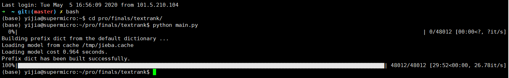

# 基于TextRank的摘要抽取
> 肖易佳 计83

## 基本原理
- 通过词之间的相邻关系构建网络，然后用PageRank迭代计算每个节点的rank值，排序rank值即可得到关键词
- PageRank本来是用来解决网页排名的问题，网页之间的链接关系即为图的边，迭代计算公式如下：

- PageRank网页分数
$$PR(V_i) = (1 - d) + d \times \sum_{j \in In(V_i)}\frac{1}{|Out(V_j)|}PR(V_j)$$

其中，$PR(V_i)$表示结点$V_i$的rank值，$In(V_i)$表示结点$V_i$的前驱结点集合，$Out(V_j)$表示结点$V_j$的后继结点集合，$d$为 _damping coefficient_，用于做平滑（模拟用户在浏览网页时，出现`疲乏`现象，离开当前网页的情况），一般取经验值：
$$d = 0.85$$


<!-- 

如对应上图的一个串"DBCA" -->


### TextRank

- 将一个句子构建成图：
    - 将字词块（语素）视为节点，共现（co-occurrence）视为边（窗格$window N$一般取$N = 2$）
    - 具体实现：代码的combine函数，相当于滑动窗格，每次对窗格内的节点互相连边

$$WR(V_i) = (1 - d) + d \times \sum_{j \in In(V_i)} \frac{w_{ji}}{\sum_{V_k \in Out(V_j)} w_{jk}} \times WR(V_j)$$


## 结果呈现
上述实验说明，由于短文本原已不长，则抽取模型的概括能力有限，并且英文的Rouge工具包和我使用的略有区别，我们使用2个指标：_Rouge、RPF_

**这里使用的PRF为自定义的，和标准的准确率、召回率评估量有区别**
`设摘要的关键词为S个，模型抽取的为T个，重合的为C个，我们定义：`
$$recall = \frac{C}{S}$$
$$precision = \frac{C}{T}$$
$$F_1score = \frac{2PR}{P + R}$$


#### Rouge 指标 
$\color{red}{damping-coefficient = 0.85}$

| Method\Score | Rouge_1 | Rouge_2 | Rouge_l |
| ------------ | ------- | ------- | ------- |
| TextRank     | 0.3699  | 0.2649  | 0.3469  |


$\color{red}{damping-coefficient = 0.80}$

| Method\Score | Rouge_1 | Rouge_2 | Rouge_l |
| ------------ | ------- | ------- | ------- |
| TextRank     | 0.2463  | 0.1137  | 0.2189  |

--- 

#### RPF指标
###### 从公式不难分析，抽取过多关键词，Precision反而会下降 $R > P$
`damping-coefficient = 0.85`

$\color{red}{15关键词抽取评估}$
| Method\Score | Recall | Precision | F-score |
| ------------ | ------- | ------- | ------- |
| TextRank     | 0.285  | 0.136  | 0.184  |

关键词准确率比我预想的低 :( 对比输出、标准摘要，解释如下：
人工摘要非常凝练，存在部分替换、概括成分，机器没有人的总结、概括能力，所以关键词指标偏低

$\color{red}{5关键词抽取评估}$
| Method\Score | Recall | Precision | F-score |
| ------------ | ------- | ------- | ------- |
| TextRank     | 0.117  | 0.216  | 0.152  |


`此次试验中，结果均已去除乱序文本`


## 比较异同
##### 相同之处
`通过此次试验，我发现TextRank与TF-IDF有异曲同工之妙：`
- TfIdf包含的`逆文档频率`，其实和Text Rank中的`投票机制`思想是一样的，即`独特性`
    - 对于Text Rank来说，每个节点的重要程度$WR$，会均匀的分配`共现`过的词汇
    - 对于TfIdf来说，我们可以词语的角度出发，每在一个文档中出现，就给该文档投一票，计出现过文档数为$n$，共有$N$篇文档，则$IDF = \frac{N}{n}$，分母的$n$就相当于 _TextRank_ 的 `Voting`

##### 不同之处
`上文分析 Idf特征 可以与TextRank的 投票 找到内在联系`
- 有无`Tf`因子可以视作二者的差异
    - TfIdf中有明确的term frequency统计
    - 而TextRank则没有
    `(但是通过滑动窗格构建节点间的边，则一定程度上缓解了这个问题，下文有总结)`
- TextRank的投票机制，能降低高频词的频率优势，但是抑制程度有限：缺少了显式的IDF修正，Text Rank有时会将`频繁词`作为关键词抽取出来，缺少了词汇的`特异性`

`一篇博客也提到了这个问题，其结论为：虽然也有投票机制，但Text Rank对于 **词语独特性** 的处理，会逊色于TFIDF`

#### 总结如下：
- **思想**
    - （同）  Text Rank算法中的`投票均分`，对应Tf Idf中的`逆文档频率特征`
    - （异）  Text Rank中，`没有显式出现`和term frequency相关的量；但是从`分数贡献`的角度来说，由于窗格的长度是确定的，term frequency高的词语，其 _degree_ 越大，能向它`贡献WR值`的邻居也就更多，其WR值越大
- **模型**
    - `TfIdf`是一个统计模型，使用的是`Bag of words`的思想，重点在于统计量，不考虑文段的时序关系
    - `TextRank`则考虑时序信息，通过滑动窗格，能够容纳一定的文本跨度
- **效率**
    - TF-IDF预处理时间长，但是计算特征值、排序比较快
    - TextRank预处理时间短，但是图内需要计算到 _WR_  值`收敛`才结束，计算时间长


## 代码分析
#### 词性分词
```python
# 导入分词工具
import jieba.posseg as pseg
def segment(self, text, lower = True, use_stop_words = True, use_speech_tags_filter = False):
    """segment text, and return a list of segments and tags"""
    text = text
    # 返回的是[词语, 词性]
    jieba_res = pseg.cut(text)
    # for seg in jieba_res:
    #     print(seg)
    if use_speech_tags_filter:
        jieba_res = [w for w in jieba_res if w.flag in self.default_speech_tag_filter]
    else:
        jieba_res = [w for w in jieba_res]

    # remove unnecessary symbols
    # x means '非语素字', 这里我们去除标点
    word_list = [w.word.strip() for w in jieba_res if w.flag != 'x']
    word_list = [word for word in word_list if len(word) > 0]

    # 使用stopwords.txt文件
    if use_stop_words:
        word_list = [word.strip() for word in word_list if word.strip() not in self.stopwords]
    return word_list
```

#### 图的建立
```python
# 滑动窗格, 建立节点间的边
def conbine(word_list, window = 2):
    """construct the edges in the text rank map"""
    # 窗格至少为2 (相邻词)
    if window < 2:
        window = 2

    # iterate all the possible window sizes
    for x in range(1, window):
        # the window's length is longer than words' number
        if x >= len(word_list):
            break
        # 偏移x, 实现window内combine的效果
        word_list2 = word_list[x:]
        # each time, we return a pair of words
        # the distance between them is 'x'
        for r in zip(word_list, word_list2):
            yield r
```

#### 图排序和更新
```python
# damping_coeffi是阻尼系数，取PageRank的0.85
# 数据类型已在函数内说明
def sort_words(vertex, edge, window, damping_coeffi=0.85):
    """sort words in descending order"""
    """vertex is 2 dim list, [ [word1, word2, ...](sentence1) , [](sentence2), ...]
    edge is also 2-dim, similar to vertex"""
    sorted_words = list()
    # map word to index and index to word
    word_index, index_word = dict(), dict()
    words_number = 0

    # indexing part: counting the words, and build 2 mapping dict
    for word_list in vertex:
        for word in word_list:
            if word not in word_index:
                word_index[word] = words_number
                index_word[words_number] = word
                words_number += 1

    # build the weight matrix for ranking
    graph = np.zeros((words_number, words_number))

    for word_list in edge:
        for w1, w2 in conbine(word_list, window):
            # iterate all the possible word pairs
            if w1 in word_index and w2 in word_index:
                index1 = word_index[w1]
                index2 = word_index[w2]
                graph[index1][index2] = 1.0
                graph[index2][index1] = 1.0

    nx_graph = nx.from_numpy_matrix(graph)
    # a dict, mapping words to scores
    scores = nx.pagerank(nx_graph, **{'alpha': damping_coeffi})
    sorted_scores = sorted(scores.items(), key=lambda item: item[1], reverse=True)
    for index, score in sorted_scores:
        item = AttrDict(word=index_word[index], weight=score)
        sorted_words.append(item)

    return sorted_words

```

#### 相似度分析
```python

def get_similarity(word_list1, word_list2):
    """used for calculating the similarity between 2 sentences"""
    # remove the duplicate ones
    words = list(set(word_list1 + word_list2))
    vec1 = [float(word_list1.count(word)) for word in words]
    vec2 = [float(word_list2.count(word)) for word in words]

    # 求内积, 实际为下一步的计数做准备
    vec3 = [vec1[i] * vec2[i] for i in range(len(vec1))]

    # 统计公共的词语数, 公共位置为 '1'
    vec4 = [1 for mul in vec3 if mul > 0.0]
    co_occur = sum(vec4)

    # the inner product is smaller than threshold
    if abs(co_occur) <= 1e-12:
        return 0.0

    # the Euclidean length of 2 vectors
    denominator = math.log(float(len(word_list1))) + math.log(float(len(word_list2)))
    if abs(denominator) < 1e-12:
        return 0.0

    # co_occur表示分子的公共部分, denominator表示分母的log(|S1|) + log(|S2|)
    return co_occur / denominator

```


##### 测试截图
TextRank处理速度如下 `TITAN X 1个CPU运行` (快于TFIDF的预处理)



### 关于评估标准的思考
`在实验中，由于PART_I的摘要为人工拟定，所以和抽取式摘要差异较大，即使Rouge、RPF评估，仍较为机械（依赖匹配的评估，无法解决人工摘要中的概括、近义词）`

我们关心的是摘要语义：或许可以先将`摘要结果`和`标准摘要`分词，接着用`word to vector`编码，再对词向量求平均，最后计算两个向量的相似度(cosine等)；这是我的一个简单想法，类似`bag of words`模型，优劣比对如下：
- 优势：词向量评估，将`语义、近义词`考虑进来，解决了 _Rouge_ 机械匹配的问题(rouge评估`抽取式+抽取式`较准确，而评估`抽取式+生成式`则不准确)
- 劣势：词向量评估，`词袋`丢失了顺序信息，而Rouge则考虑顺序信息
<!-- > 使用
 -->

## Acknowledgement
- _NLP & TM_ 课程第10讲课件
- 助教提供的论文、实验指导
- TextRank工具包：通过阅读工具包源码，辅助我理解算法，给我非常大帮助，感谢作者

`在此表示感谢！`